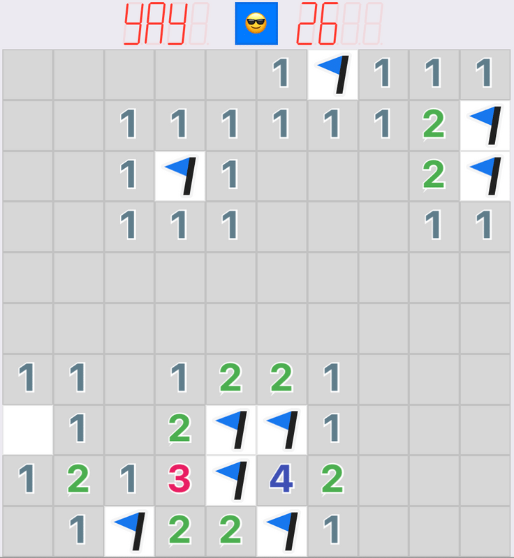
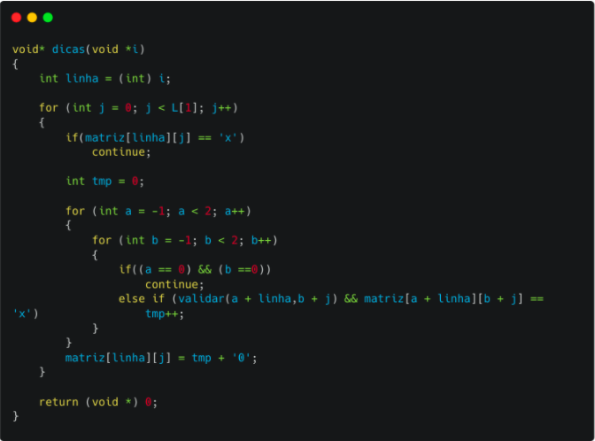
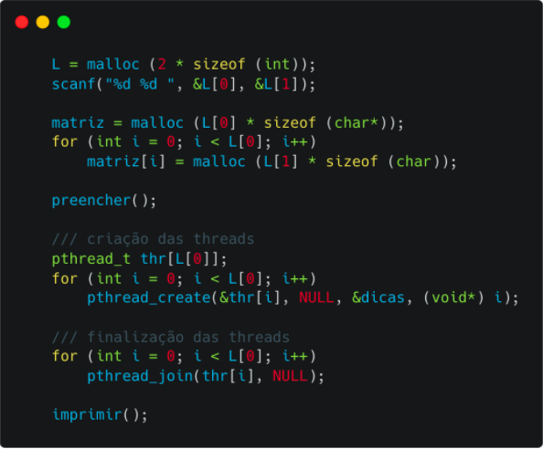
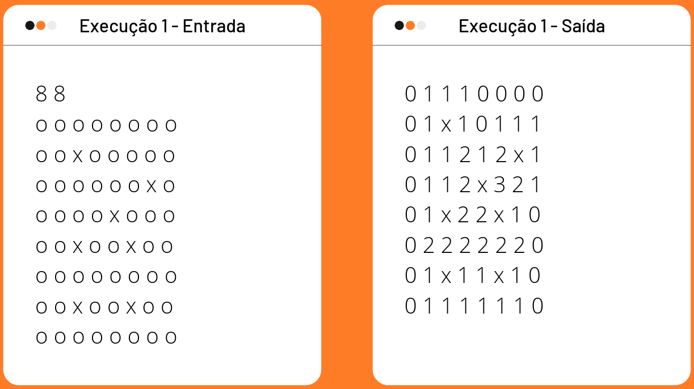
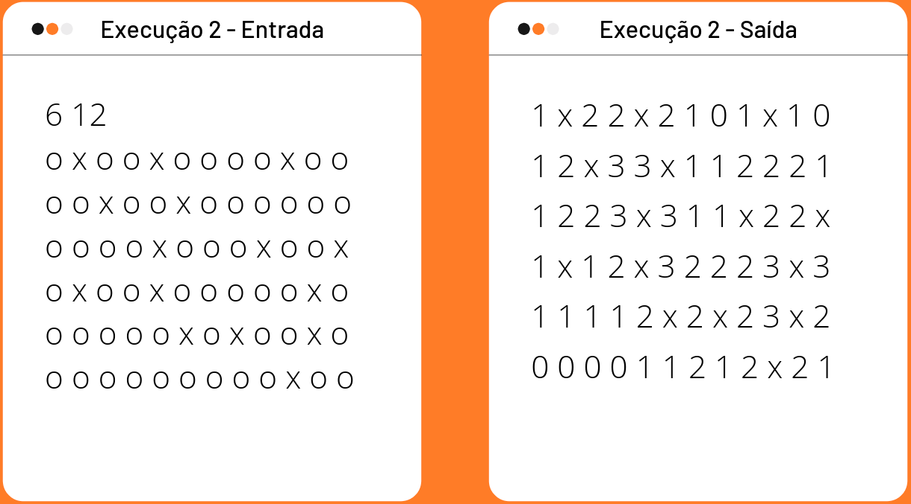
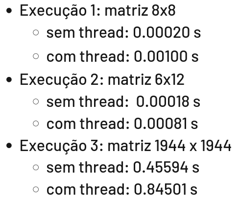

# Projeto 1 - Aplicação de Multithreads

## Equipe
- Áureo Henrique e Silva Marques - RA 213374
- Jonas Cardoso Gonçalves - RA 256453
- Lethycia Maia de Souza - RA 256477

## Apresentação da ideia

Campo Minado é um jogo de apenas um jogador que tem como objetivo revelar um campo de minas sem que as mesmas sejam detonadas. No campo, há espaços com as minas, que quando detonadas adquirem um símbolo de bomba e detonam as outras minas do jogo, encerrando o jogo, e os espaços de "dicas", representados por números que correspondem a quantas bombas existem ao seu redor.

Através da utilização de threads, a ideia deste projeto é desenvolver um programa que recebe, como entrada, uma matriz de minas e retorna, como saída, uma matriz de dicas. A estrutura de dados principal é uma matriz de entrada de tamanho m x n com valores 'x', representando as bombas, e 'o', onde não há bombas. O algoritmo, então, realiza um processamento sobre essa estrutura e monta a matriz de dicas do jogo, substituindo o símbolo 'o' pelo número adequado.

## Uso das threads

O cálculo de bombas é feito usando threads, onde o processo de contagem de minas e troca do elemento 'o' pelo número de bombas ao redor do campo será feito concorrencialmente em todas as linhas da matriz de entrada. 

O algoritmo executado em cada thread percorre a linha da matriz em busca de um elemento que não é uma mina. Ao achar esse, ele inicia sua contagem em zero e percorre os 8 vizinhos desse espaço, contando as bombas.

## Destaques de código

A função "dicas" é o método passado para cada thread e é responsável pela tarefa de contagem de bombas e substituição dos valores na matriz. Ela recebe como parâmetro a linha em que a thread vai atuar. Com isso, a função percorre cada posição da linha, analisando a quantidade de bombas presentes nas posições vizinhas e, por fim, insere tal quantidade na respectiva posição.

Para a criação das threads, primeiramente é realizada a leitura da matriz de bombas. Em posse da dimensão dessa matriz, as threads são criadas utilizando o método "pthread_create" e passando para ele o id da thread, a função "dicas" e o parâmetro "i", o qual indica a linha da matriz. Em seguida, é usado "pthread_join" para finalização das threads.

## Exemplo de execução

Foram realizadas duas execuções para analisar o funcionamento do código. A primeira com uma matriz de dimensão 8x8 e a segunda com uma matriz de 6x12. Abaixo, são mostrados os resultados dessas execuções.

## Experimento do tempo

Para analisar o efeito da aplicação de threads no tempo de execução do código, implementamos a mesma lógica do jogo, porém sem utilizar threads. Com essa nova versão, executamos os mesmos dois exemplos, apresentados anteriormente, e, além deles, um exemplo em que a entrada é uma matriz com dimensão bem maior, 1944 x 1944. O tempo gasto para cada execução em cada código é apresentado abaixo.

Analisando o tempo gasto nas execuções, podemos concluir que a execução com threads é mais custosa em relação a sem threads, tanto nas matrizes de pequena dimensão como na de maior tamanho. Isso ocorre, pois, embora o uso de threads paralelize o processamento do código, a máquina deve gastar um tempo para criação e para finalização das mesmas.
